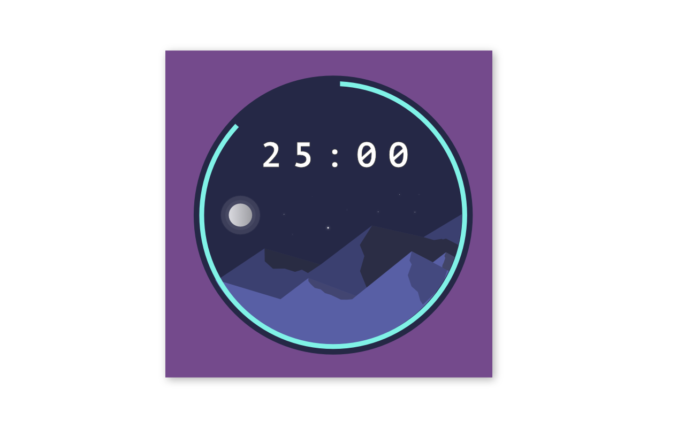
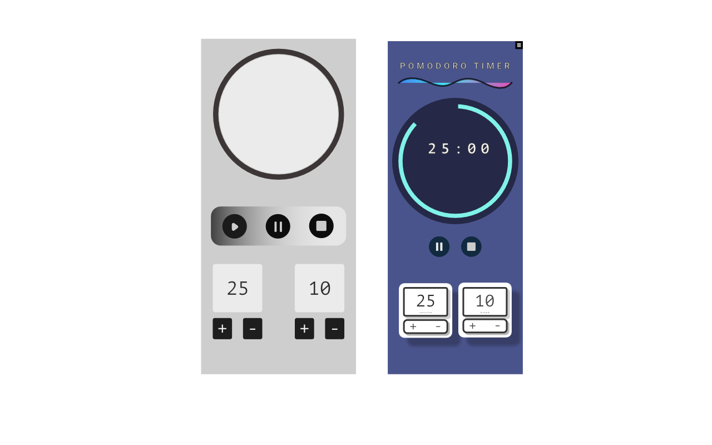

# POMODORO CLOCK

The Pomodoro Technique, is a method for time management by which uses a timer to break down work into intervals. Traditionally they are each 25 minutes in length, and are separated by short breaks.

The Pomodoro Clock has a to-do list to help keep track of items while having a timer whose intervals are adjustable.

I first thought of building the pomodoro clock while reading the FreeCodeCamp blog online.
They suggested building it as a challenge to strengthen your javascript skills.

I began creating mockups on Affinity Designer, not only to have an attractive design, but also help visualise the user stories.

I often begin with a grayscale design -- this helps me obtain results quickly.

The following is the first rendition of designs I created for the clock:

I then decided that I wanted to include more art into the design and created a new iteration of the timer involving illustrations. Furthermore, I decided to make it in 'dark mode'.

Here is what I came up with:

Once I had the main design (i.e the clock) out of the way, I began creating the wireframes (mobile-first), and continued onto the desktop.

Here are the final renditions of the wireframes:

## Mobile First Designs

## Desktop Design

